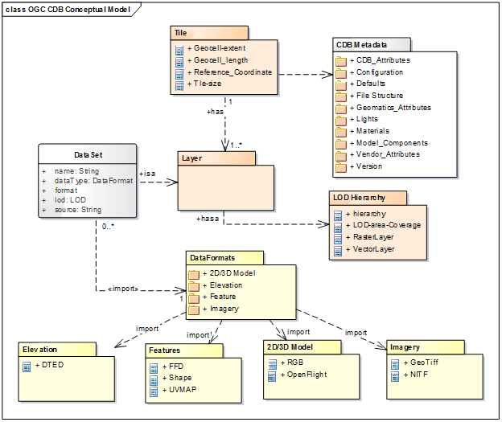
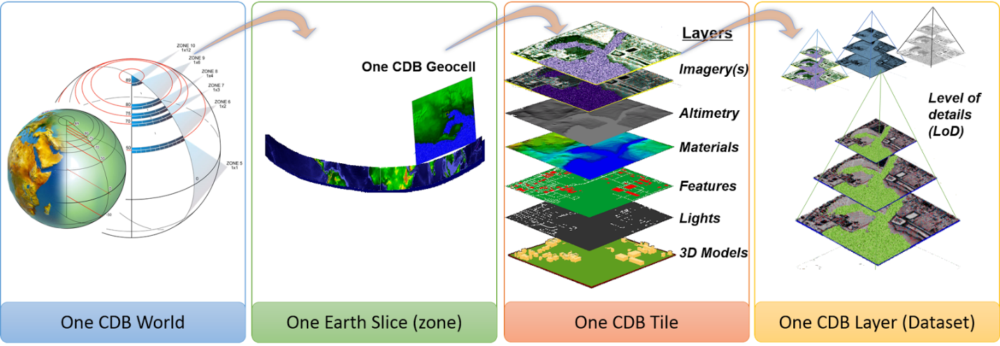

== Overview of the OGC CDB Conceptual Model

A conceptual model is a representation of a system, made of the composition of concepts which are used to help people know, understand, or simulate a subject the model represents. A documented conceptual model represents 'concepts' (entities), the relationships between them, and a vocabulary. This document details the conceptual model for a CDB data store.

In this document, conceptual modelling is used as a structural methodology for describing how the components of a CDB data store may be implemented based on the requirements amd guidance specified in the OGC CDB Core Standard. The following table defines the general CDB data store requirement and an overview of key elements implemented in a compliant CDB data store.

include::requirements/REQ001.adoc[]

This section describes the conceptual model for an OGC CDB compliant data store. This model can used as the basis for the CDB standard in other application domains, along with its requirements, extension, file-based structure, data formats, access, and the discovery of services.

[#img_PackagediagramofOGCCDBdatastoreconceptualmodel,reftext='{figure-caption} {counter:figure-num}']
.Package diagram of OGC CDB data store conceptual model

The CDB data store structure is designed to provide efficient access to any location enabled content accessible in the data store. The main properties of the CDB data store UML diagram are documented below.

[cols=",,,",]
|===
|*Name* |*Definition* |*Data type & Value* |*Multiplicity*
|Tile |Geographically divides the world into geodetic tiles (bounded by latitudes and longitudes), each containing at least a dataset |Dataset type. |One or more (mandatory)
|LOD Hierarchy |Each dataset layer has a LOD hierarchy. |Hierarchy of raster, vector and models. |One (mandatory)
|Dataset |Defines the basic storage unit used in a CDB data store. |Layers of data |One (mandatory)
|Models |Includes 3D representations of cultural features and moving models such as buildings, pylons and posts, aircraft and other moving platforms. 3D models have various model components |Model data formats supported in CDB standard. |Zero or more (optional)
|Imagery |There are various imagery types in a CDB data store such as representation of geo-referenced terrain, elevation, and texture. |Image data formats supported in the CDB standard such as GeoTIFF, JPEG 2000, etc. |Zero or more (optional)
|Vector Features |This includes all the vector feature datasets in a CDB which are defined based on the Feature Data Dictionary. |Vectors data formats supported by the CDB such as shapefile and etc. |Zero or more (optional)
|Elevation |Depicted by a grid of elevation data elements at regular geographic intervals, which include DEM, MinMaxElevation and MaxCulture footnote:[The values of this component are based on the heights of culture features with respect to the corresponding LOD of the culture, be it its bounding sphere, its bounding box or its modeled representation (if supplied).]. |Grid of terrain altimetry data |Zero or more (optional)
|Metadata/Controlled Vocabularies |CDB XML files that include the default hierarchies, naming, and values to be used by client devices. |XML association |one or more (mandatory)
|===

As it can be seen in Figure 2, the CDB standard relies on three important concepts to organize geospatial data: Tiles, Layers (or datasets) and Levels of Detail (LOD) which are described here.

* Tiles: Tiles organize the data into zones defined by location with respect to a WGS84 reference system footnote:[Please see CDB Spatial Reference System Guidance - Volume 8]. The CDB storage structure allows efficient searching, retrieval and storage of any information contained within a CDB data store. The storage structure portion of the standard geographically divides the world into geodetic tiles (bound by latitudes and longitudes), each containing a specific set of features (such as terrain altimetry, vectors) and models (such as 3D and Radar Cross Sections models), which are in turn represented by their respective datasets. The datasets define the basic storage unit used in a CDB data store. The geographic granularity is at the tile level while in each tile, the information granularity is at the dataset level defined by layers.
* Layers: Layers organize different types of data in a tile. The CDB standard data store model is also logically organized as distinct layers of information. The layers are independent from each other (i.e., changes in one layer do not impose changes in other layers).
* Levels-of-Detail (LODs): LODs organize the data in each layer of each tile by its detail. The availability of LOD representations is critical to real-time performance. Most simulation client-devices can readily take advantage of an LOD structure because, in many cases, less detail/information is necessary at increasing distances from the viewpoint of a simulation rendering. The CDB standard requires that each geographic area be represented in an LOD hierarchy in accordance with the availability of source data.

[#img_CDBdataorganizationstructure,reftext='{figure-caption} {counter:figure-num}']
.CDB data organization structure

