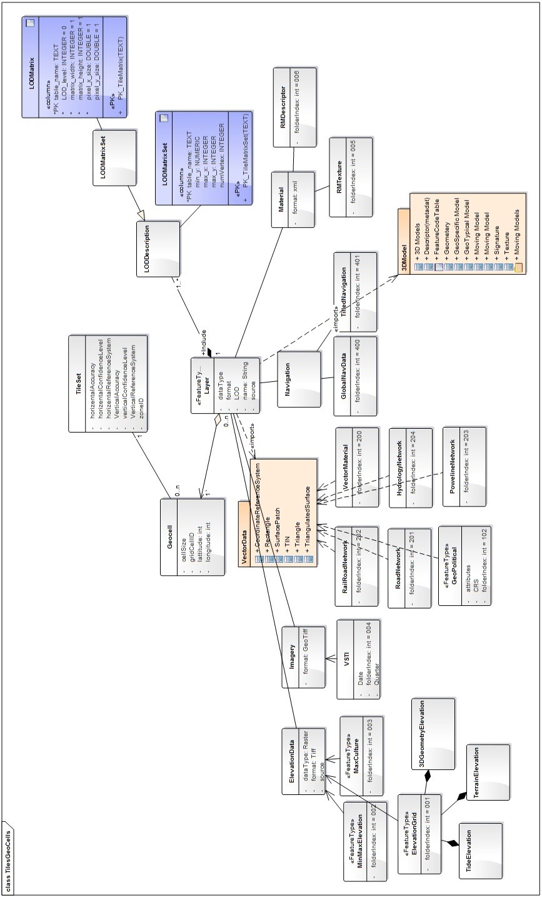
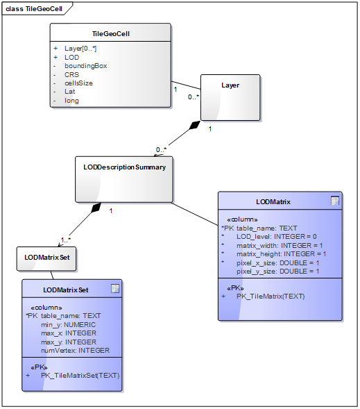
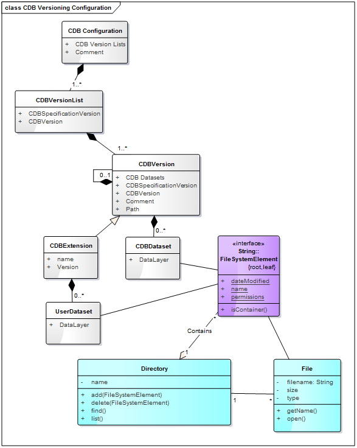
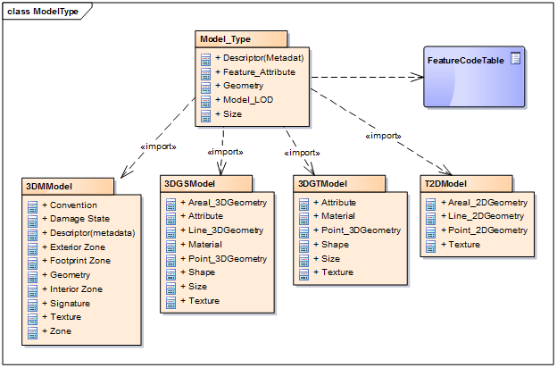
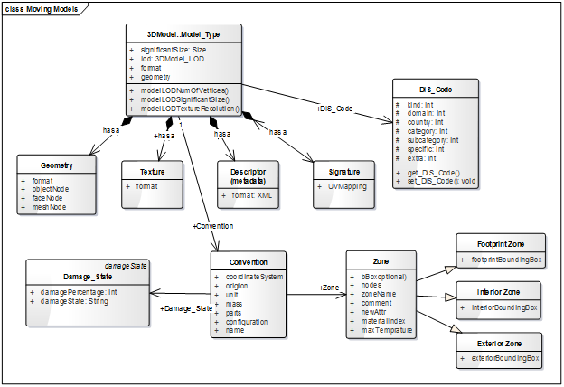
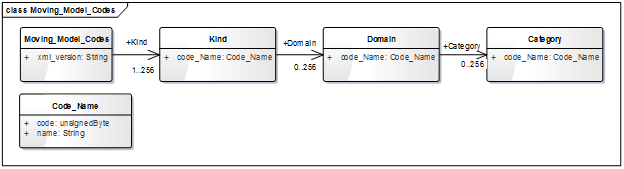
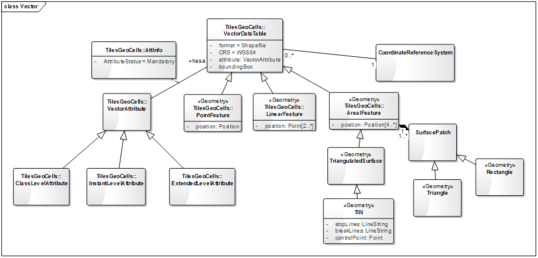

== CDB General Data Organization

The CDB is composed of several datasets that share a common structure. The following sections present the general organization and structure of all CDB datasets. The CDB standard does not define or enforce an operating system or file system. Nonetheless, the implementation of a CDB storage sub-system must conform to absolute minimum file system requirements called for by the standard. A CDB data store uses existing common file formats for storing data in various formats such as TIFF/GeoTIFF (raster data), JPEG 2000 (imagery data), OpenFlight (3D models), GeoPackages (vector data and radar cross sections), ShapeFiles (vector data and radar cross sections), SGI image format aka RGB (textures), XML (Metadata) and ZIP (file collection). The current version of CDB uses a consolidation of data dictionaries from DIGEST, DGIWG, SEDRIS and UHRB (See Volume 3: CDB Terms and Definitions). In addition, it is possible to extend the CDB Feature Data Dictionary (FDD) by using the extension capabilities and adding a new FDD XML schema file to access additional feature data codes. The UML diagram in Figure 3 describes how the data is categorized in tiles, layers and LODs. This is the basis for the CDB geospatial data categorization.

[#img_UMLdiagramoftheCDBgeneraldataorganization,reftext='{figure-caption} {counter:figure-num}']
.UML diagram of the CDB general data organization

This diagram is the general data organization for the CDB. The main properties of the CDB general data organization UML diagram are documented below.

[cols=",,,",]
|======================================================================================================================================================================================================================================================================================================
|*Name* |*Definition* |*Data type & Value* |*Multiplicity*
|Raster Dataset |Data elements are organized into a regular grid evenly positioned. Raster Datasets always have a fixed number of elements corresponding to their LOD spec. |Raster data formats supported in CDB Core Standard for elevation, imagery, texture and grid data. |Zero or more (optional)
|Vector +
Dataset |The point, the lineal, and the areal (polygon) features of the CDB are organized into several Vector Datasets and into LODs. For each CDB LOD, the maximum number of points allowed per Tile-LOD and the resulting average Feature Density is defined. a|
RMDescriptor, GSFeature, GTFeature, GeoPolitical, VectorMateria, RoadNetwork, RailRoadNetwork, PowerLineNetwork, HydrographyNetwork,

vectors(Shape)

 |Zero or more (optional)
|Model Dataset |Includes 3D GTModel, GSModel, MModel & 2D Model or cultural feature such as air platforms, buildings and pylons and posts. 3D models have various model components. a|
GSModelGeometry, GSModelTexture, GSModelSignature, GSModelDescriptor, GSModelMaterial,

GSModelInteriorGeometry, GSModelInteriorTexture, GSModelInteriorDescriptor, GSModelInteriorMaterial, GSModelCMT, T2DModelGeometry,

OpenFlight models

 |Zero or more (optional)
|Navigation |Navigation library is composed of a single dataset. |NavData |Zero or more (optional)
|======================================================================================================================================================================================================================================================================================================

=== LOD and Geocell

This section shows the relationship between the tile structure, layers and LODs. As can be seen in Figure 4, any TileGeoCell class may have any number of layers and each layer is associated with a LOD matrix set.

[#img_UMLdiagramoftheGeocell,tileandLODconcept,reftext='{figure-caption} {counter:figure-num}']
.UML diagram of the Geocell, tile and LOD concept

=== CDB File System

This section describes how a current version of a CDB conformant data store uses the computer’s native file system to store data in files and directories, what the CDB versioning structure is, and how the data is categorized. Further, this section defines the structure of a CDB conformant data store, i.e., the name of all directories forming the CDB hierarchy, as well as the name of all files found in the CDB hierarchy. An important feature of the CDB standard is that all CDB file names are unique and that the filename alone is sufficient to infer the path of the file.

The CDB data store is composed of several datasets that usually reside in their own directory. However, some datasets share a common structure. The top-level directory of the CDB data store follows the following structures.

* \CDB\: This is the root directory and does not need to be “\CDB\” and can be any valid path name on any disk device or volume under the target file system it is stored on.
* \CDB\Metadata\: This directory contains the specific XML metadata files which are global to the CDB.
* \CDB\GTModel\: This is the entry directory that contains the Geotypical footnote:[A model is said to be geotypical if it instanced multiple times within a CDB data store. Geotypical models correspond to representative (in shape, size, texture, materials and attribution) models of real-world manmade or natural 3D cultural features.] Models Datasets.
* \CDB\MModel\: This is the entry directory that contains the Moving Models Datasets.
* \CDB\Tiles\: This is the entry directory that contains all tiles within the CDB instance.
* \CDB\Navigation\: This is the entry directory that contains the global Navigation datasets.

Most of the CDB datasets are organized in a tile structure and stored under \CDB\Tiles\ directory. The tile structure facilitates access to the information in real-time by any runtime client-devices. However, for some datasets such as Moving Models or Geotypical Models that require minimal storage, there is no significant advantage to their being added into such a tile structure. Such datasets are referred to as global datasets. They consist of data elements that are global to the earth.

A CDB Version is a collection of CDB and/or user-defined datasets. A CDB Version contains data belonging to a single version of a CDB conformant data store. One CDB Version may refer to another one, which is the basis for the CDB File Replacement Mechanism. The concept of a CDB Version is illustrated using the following UML diagram (Figure 4).

[#img_UMLdiagramofCDBversionconcept,reftext='{figure-caption} {counter:figure-num}']
.UML diagram of CDB version concept

The diagram shows that a CDB Version contains CDB Datasets. In addition, it states which CDB Version Number has been used to build the CDB content. Finally, the CDB Version has a reference to another CDB Version. This reference allows the creation of a chain of CDB Versions. By chaining two CDB Versions together, the user can replace files in a previous CDB Version with new ones in a newer CDB Version data store. The diagram shows that a CDB Extension inherits all the attributes of a CDB Version and adds its own attributes, a name and a version number (of the extension). The client application checks the name attribute to recognize and process known CDB Extensions and unrecognized CDB Extensions are skipped.

=== Model Type

The term Model refers to all of the modeled representations of a cultural feature. The model type features of a CDB can be represented using the following UML diagram. 3DModel, referred to as a GSModel, is unique. In the case where the 3DModel is instanced, it is referred to as a GTModel. A 3DModel that is capable of movement is called a MModel. In the case where a MModel is positioned by the modeler, it is called a statically-positioned MModel.

[#img_UMLpackagediagramofthemodeltype,reftext='{figure-caption} {counter:figure-num}']
.UML package diagram of the model type

The term Model-LOD refers to a specific level of detail of a Model. The main properties of the CDB 2D/3D model type UML diagram are listed below.

[cols=",,,",]
|=================================================================================================================================================================================================================================
|*Name* |*Definition* |*Data type & Value* |*Multiplicity*
|Model_Type |The modeled representation of a feature primarily consists of its geometry and textures and encompasses its exterior and interior. |3D model formats supported by the CDB such as OpenFlight |Zero or more (optional)
|3DGTModel |Geotypical 3D Model is a geotypical representation of a point-feature that is anchored to the ground. |3D model formats supported by the CDB such as OpenFlight |Zero or more (optional)
|3DGSModel |Geospecific 3D Model is geospecific representation of a point, lineal- or areal feature that is anchored to the ground. |3D model formats supported by the CDB such as OpenFlight |Zero or more (optional)
|T2DModel |Tiled 2D Model is geospecific or geotypical representations of lineal and areal (polygon) features that are anchored to the ground. |2D model formats supported by the CDB such as shapefiles |Zero or more (optional)
|3DMModel |3D modeled representations of point-features that are not anchored to the ground. |3D model formats supported by the CDB such as OpenFlight |Zero or more (optional)
|=================================================================================================================================================================================================================================

==== 3D Moving Model

A moving model is typically characterized as if the feature can move (on its own) or be moved. More specifically within the context of this standard, the model is not required to be attached to a cultural point feature (geographic location).

[#img_UMLdiagramofthe3Dmovingmodel,reftext='{figure-caption} {counter:figure-num}']
.UML diagram of the 3D moving model

During the course of a multi-player simulation, each client-device is typically solicited to provide a modeled representation of each player. The activation of such players requires the client-device to access the appropriate modeled representation of each player. There are a large number of simulations where the player types are characterized by their Distributed Interactive Simulation footnote:[IEEE 1278 series Distributed Interactive Simulation.] (DIS) code. To this end, the CDB data store provides a moving model library whose structure provides a convenient categorization of models by their DIS code as shown in the following diagram.

[#img_UMLdiagramofmovingmodelcodes,reftext='{figure-caption} {counter:figure-num}']
.UML diagram of moving model codes

The “xml_version” attribute of a moving model code is used to indicate the version of the XML file containing the list of codes. It is independent from the version of the Standard and also the version of the Schema.

=== Vector Data Model

Vector tiles differ from their raster counterpart in three important ways. First of all, the vector tiles’ internal structure permits a non-uniform distribution of elements within the tile, i.e., the position of each element within the tile is explicit. Secondly, the vector tiles’ internal structure permits a variable number of elements within a tile’s boundary. Finally, the distribution of the element types from a single list can be controlled.

Conceptually, the LOD of a vector tile implicitly provides the average density of elements within the tile. The run-time level-of-detail behavior that controls the rendered number of data elements depends on various parameters and on the off-line filtering process.

[#img_UMLdiagramofvectordatamodel,reftext='{figure-caption} {counter:figure-num}']
.UML diagram of vector data model

