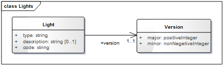
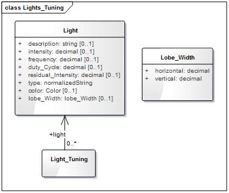
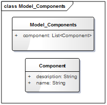
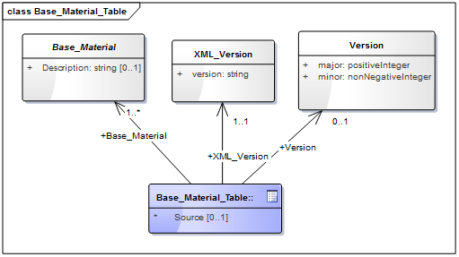
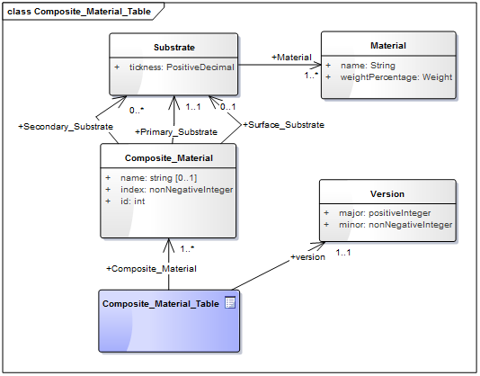
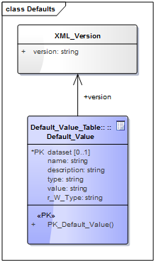
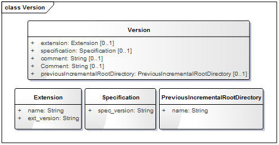
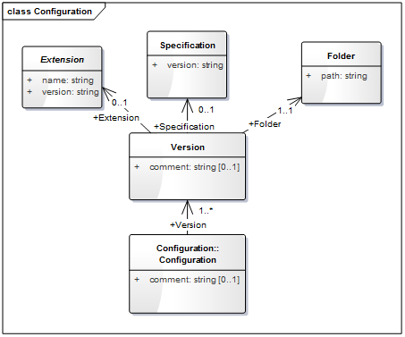
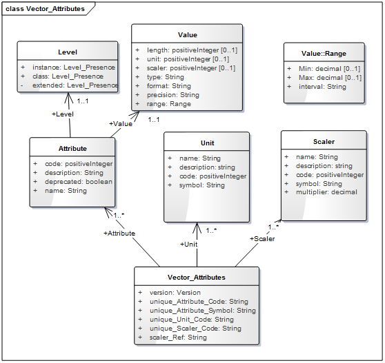
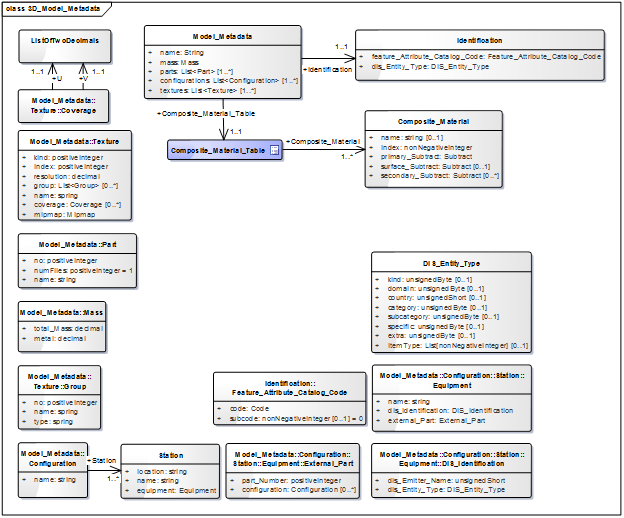

== Metadata and Controlled Vocabulary Schema

Metadata and controlled vocabulary datasets contain information, global to a CDB implementation that defines its structure, naming hierarchies, default values, allowable values, and status. All metadata files are formatted using XML files, and their XSD schemas can be found in the \CDB\Metadata\Schema\ folder delivered with the CDB Standard.

=== Light Names Hierarchy

The light name hierarchy for a CDB compliant data store is described in detail within the table found in Volume 2 Annex J of the OGC CDB Core Standard footnote:[http://www.opengeospatial.org/standards/cdb]. This Annex provides a description of the entire naming hierarchy, including the hierarchical relationship of the levels with respect to each other and the position of each light type within this hierarchy. To this end, the lights hierarchy definition controlled vocabulary is stored in an XML file in the metadata CDB directory. “Lights.xml” file contains the name of each light type and a unique code with each light type. Light codes have a one-to-one association with light types; consequently, the light codes are unique among all light types. For run-time access of this data, clients must be able to retrieve such information. The below diagram (figure 9) shows the UML diagram of light data hierarchy to define and validate the content of the CDB light names hierarchy found in /CDB/Metadata/Lights.xml.

[#img_UMLdiagramoflightnameshierarchy,reftext='{figure-caption} {counter:figure-num}']
.UML diagram of light names hierarchy

This attribute “Version” represents the version number of the Light.xml file.

=== Client Specific Lights Definition

Client-devices use the light type code as an index to lookup the client-specific properties and characteristics of each light type using a Lights_xxx.xml. The CDB standard offers a complementary approach to modifying the appearance of lights. This approach provides basic control over light intensity, color, lobe width and aspect, frequency and duty cycle for potential use by simulation implementations. This approach also permits a modeller to add new light types to the CDB light hierarchy. The below UML diagram (figure) presents the schema for the fields of the Lights_xxx.xml which is generated from the schema file located at \CDB\Schema\Lights_Tuning.xsd.

[#img_UMLdiagramofclientspecificlightsdefinition,reftext='{figure-caption} {counter:figure-num}']
.UML diagram of client specific lights definition

=== Model Components Definition

The CDB Standard provides the means to unambiguously tag any portions of a 3D model (moving model or cultural feature with a modeled representation) with a descriptive name. Component model names are stored in the model components’ definition file, at \CDB\Metadata\Model_Components.xml which is delivered with the standard distribution package.

[#img_UMLdiagramofthemodelcomponentsdefinition,reftext='{figure-caption} {counter:figure-num}']
.UML diagram of the model components definition

CDB Model Components is a list of components which are made up of the component names along with their descriptions.

=== Base Materials Table

A Base Material represents a basic material such as water, vegetation, concrete, glass, or steel. Each Base Material used in a CDB data store has a unique name. The components of a Base Material are listed in Volume 1 Section 2.5.1 of the CDB Core standard in Table 2-6: Components of a Base Material. A Base Material Table (BMT) is provided for run-time access by client applications. More details on the file format can be found in Volume 1 Core Standard section 5.1.3, Base Material Table. CDB Base Materials are listed and stored in an XML file named \CDB\Metadata\Materials.xml. The format of the file is defined by the following UML diagram generated from an XML schema that is delivered with the CDB standard in the file named \CDB\Metadata\Schema\Base_Material_Table.xsd.

[#img_UMLdiagramofthebasematerialstable,reftext='{figure-caption} {counter:figure-num}']
.UML diagram of the base materials table

The main properties of the base materials table UML diagram are documented below.

[#table_BaseMaterial_UML]
.The definition of major properties of base materials UML diagram
|=======================================================================================================================================================================================
|*Name* |*Definition* |*Data type & Value* |*Multiplicity*
|Base_Material |This element defines one CDB Base Material by giving it a unique name. It is recommended to provide a description. |XML |One or more (mandatory)
|XML_Version |This element indicates the version of the XML file containing the list of CDB Default Values. It is independent from the version of the Standard. |string |One (mandatory)
|Version |This attribute represents the version number of this file. |Version |One (mandatory)
|=======================================================================================================================================================================================

=== Composite Material Tables

Composite Material Tables provide a structured arrangement by which Composite Materials can be defined. There are several Composite Material Tables spread across the CDB hierarchy. A CMT is a list of one or more composite materials. Note that all Composite Material Tables follow the following UML diagram.

[#img_UMLdiagramofcompositematerialtables,reftext='{figure-caption} {counter:figure-num}']
.UML diagram of composite material tables

The main properties of the composite material tables’ UML diagram are documented below.

[#table_CompositeMaterial_UML]
.The definition of major properties of composite materials UML diagram
|=====================================================================================================================================================================================================================================
|*Name* |*Definition* |*Data type & Value* |*Multiplicity*
|Composit_Material |Each composite material has a unique identification number, a name, and one or more substrates. |XML |One or more (mandatory)
|Material |Each material is identified by the name of its base material and by its proportion in the substrate. This class has a weightPercentage which is an integer in the range [1,100]. |Array of strings |One or more (mandatory)
|Substrate |A substrate has a certain thickness and is composed of one or more base materials. |positive decimal |One or more (mandatory)
|Version |This attribute represents the version number of this file. |Version |One (mandatory)
|=====================================================================================================================================================================================================================================

=== Default Values Definition Table

Default values for all datasets can be stored in the default values’ metadata file “\CDB\Metadata\Defaults.xml”. Default values, defined throughout the CDB standard, are listed in Volume 2 Annexes for the Core CDB Standard (normative) - Annex S and the below UML diagram indicates the schema provided in \CDB\Metadata\Schema\Defaults.xsd to define and validate the content of Defaults.xml. There are two types of default values: read and write default values (‘R’ or ‘W’.) Generally, read default values are values to be used when optional information is not available. Write default values are default values to be used by CDB creation tools to fill mandatory content when information is either missing or not available. The default value name is a unique name identifying a default value for a given dataset. Valid default value names are listed in Annex S. Each default value has a type. Valid default value data types are “float”, “integer” and “string”.

[#img_UMLdiagramofthedefaultvaluesdefinitiontable,reftext='{figure-caption} {counter:figure-num}']
.UML diagram of the default values definition table

The “XML_Version” attribute is used to indicate the version of the XML file containing the list of CDB Default Values. It is independent from the version of the standard.

=== Version

Each CDB version has a version control file that is called Version.xml. Its contents should be defined and validated by the following UML diagram which is generated from the content of Defaults.xsd in the schema folder of the CDB.

The optional <PreviousIncrementalRootDirectory> element is used to refer to another CDB Version. This is the mechanism used to chain together two CDB versions. The mandatory <Specification> element indicates the CDB standard that is used to produce the content of the CDB Version. Note that version numbers of the standard are limited to the version numbers from the legacy industry-maintained CDB specification, specifically 3.2, 3.1, and 3.0. For the OGC standard, allowed versions are 1.0, 1.1, and 1.2. All the OGC versions are backwards compatible. Other values are not permitted. Finally, the optional <Extension> element indicates that this CDB Version is in fact a CDB Extension. A version control file that does not have a CDB Extension indicates that the CDB Version holds content that strictly follows the CDB standard.

A CDB Extension corresponds to user defined information, which is not described or supported by the CDB standard, stored within the CDB Version. As an example, such additional information could be client or vendor-specific information used to increase system performance. Any user defined information shall not replace or be used in place of existing CDB information. A CDB Extension only contains vendor or device specific information.

[#img_UMLdiagramoftheversion,reftext='{figure-caption} {counter:figure-num}']
.UML diagram of the version

=== Configuration

The CDB Configuration and CDB Version mechanisms allow users to manage the CDB by offering the following capabilities:

* The CDB can have multiple simultaneous independent CDB Configurations.
* Each CDB Configuration is defined by an ordered list of CDB Versions.
* A CDB Version is either a collection of CDB Datasets or a collection of user-defined datasets called a CDB Extension

The Configuration metadata file provides the means of defining CDB Configurations. The complete XML schema is provided in /CDB/Metadata/Schema/Configuration.xsd delivered with the standard and displayed below.

[#img_UMLdiagramofconfigurationmetadata,reftext='{figure-caption} {counter:figure-num}']
.UML diagram of configuration metadata

A single XML file, named Configuration.xml, completely defines the configuration of a CDB. This way, the client application does not have to traverse the linked list of CDB Versions through the 'PreviousIncrementalRootDirectory' element found in Version.xml.
The main properties of the configuration metadata UML diagram are documented below.

[#table_Configuration_UML]
.The definition of major properties of configuration metadata UML diagram
|===============================================================================================================================================================================================================================================================================================================================================================
|*Name* |*Definition* |*Data type & Value* |*Multiplicity*
|Configuration |The CDB Configuration is a simple list of one or more CDB Versions. |XML |One or more (mandatory)
|Extension |Indicates that the CDB Version contains extensions to the CDB Specification. The CDB Extension is identified by a name and a version number. |Array of strings |Zero or more (optional)
|Folder |Provides a non-empty path to a folder. A relative path is preferred although an absolute path is supported. |string |One (mandatory)
|Specification |Specifies the version of the CDB Specification/Standard used to generate the current CDB Version. If 'Specification' is omitted, the version number is deemed to be 3.0. For the OGC version of the standard, the Version number is 1.0, 1.1, and so forth. |string |Zero or more (optional)
|Version |A CDB Version points to the folder where the data for that version resides. An optional comment can be used to describe the version. It is possible to indicate to which version of the CDB Specification/Standard the CDB Version complies. Finally, the CDB Version can indicate if it contains extensions to the standard. |String |One (mandatory)
|===============================================================================================================================================================================================================================================================================================================================================================

=== CDB Vector Attributes

The CDB attributes are listed and described in Volume 1: CDB Core section: CDB Attribution.
The controlled vocabulary for these attributes is stored in \CDB\Metadata\CDB_Attributes.xml and the following diagram indicates the schema file as provided in the CDB schema folder, `Vector_Attributes.xsd`.
In essence, the file is the transposition of CDB Attributes into a format more appropriate for a computer program.

[#img_UMLdiagramoftheCDBvectorattributes,reftext='{figure-caption} {counter:figure-num}']
.UML diagram of the CDB vector attributes

The UML diagram is composed of three elements (i.e., attributes, units and scalers), the first one being the most important.
_Value_ contains the main properties of the vector attributes i.e. data type, enumeration, length, format, range, usage, units, compatibility.
The main properties of the vector attributes’ UML diagram are documented below.

[#table_VectorAttribute_UML]
.The definition of major properties of vector attributes UML diagram
|===
|*Name* |*Definition* |*Data type & Value* |*Multiplicity*

| Vector_Attributes
| Attributes are defined through 3 lists: 1) the attributes themselves, 2) their units, and 3) their scalers.
| Vector_Attributes ComplexType
| One (mandatory)

| Version
| This represents the version number of the file which has two components: major and minor.
| String
| One (mandatory)

| Attributes
| Attributes are used to describe one or more real or virtual characteristics of a feature. Attributes have three characteristics: +
  - _Code_: A unique four-digit numeric code associated with each attribute. +
  - _Symbol_ (Identifier): A unique three-character or four-character alphanumeric identifier associated with the attributes that are governed by this standard. +
  - _Deprecated_: States if the attribute is deprecated or not.
| Vector_Attributes ComplexType
| One or more (mandatory)

| Level
| It provides the schema level of the attribute such as class-level, instance-level and extended-level.
| Level ComplexType
| One (mandatory)

| Value
| Attribute values give quantitative/qualitative meaning to the attribute. This property includes the data type, enumeration, length, format, range, usage, and units of each attribute.
| Value ComplexType
| One (mandatory)

| Compatibility
| Provides compatibility and origin of attributes specified in the OGC CDB V1.x Standard. The current values are OGC CDB 1.0, DIGEST 2.1, DIGEST, and SEDRIS.
| Compatibility ComplexType
| Zero or more (optional)

| Allocation
| This element shows allocation of CDB attributes to each of the Vector datasets. The CDB Standard limits the applicability of each of the CDB attributes to certain vector datasets.
| Allocation ComplexType
| Zero or more (optional)

| Units
| A list of Unit definitions, such as meters and degrees.
| Units ComplexType
| One or more (mandatory)

| Scalers
| A list of Scaler definitions, such as kilo, with a code and symbol for each Scaler.
| Scalers ComplexType
| One or more (mandatory)

|===

[NOTE]
====
As described in CDB V1.3  - Volume 10 (CDB Attribution Roadmap), CDB V1.3 attribute schema (`Vector_Attributes.xsd`) is modified from the previous versions.
Based on recommendations generated by the SOFWERX Sprint ER Attributions sub-group, CDB attribute schema is enhanced to be more compatible with other modernized attribute schemas (e.g., NAS).
The changes to the vector attribute schema are itemized below:

. `Definition` property added to "Attributes"
. `UsageNote` property added to "Attributes"
. `Compatibility (Origin)` ComplexType added to "Attributes"
. `Allocation` ComplexType added to "Attributes"
. `Default` property added to "Value" of "Attributes"
. `Enumeration` property added to "Value" of "Attributes"

For more information on these changes please refer to CDB V1.3  - Volume 10 (CDB Attribution Roadmap).
====

=== 3D Model Metadata

The following UML presents an XML schema file in the CDB schema folder which defines the metadata associated with 3D models. These metadata are in accordance with legacy industry-maintained versions of the CDB specification and includes name, feature data dictionary, mass, part, texture and materials.

[#img_UMLdiagramof3Dmodelmetadata,reftext='{figure-caption} {counter:figure-num}']
.UML diagram of 3D model metadata

The main properties of the 3D model metadata UML diagram are documented below.

[#table_3DMode_UML]
.The definition of major properties of 3D model metadata UML diagram
|===
|*Name* |*Definition* |*Data type & Value* |*Multiplicity*
|3D_Model_Metadata |The metadata associated with a model is made of up to seven elements. |XML |One (mandatory)
|Identification |A 3D model is either a moving model with a DIS Entity Type, or a cultural feature with a feature code (FC). |DIS or FC |One (mandatory)
|DIS_Entity_Type |This type has two formats: 1) a simple list of up to 7 integers; or 2) a sequence of up to 7 elements providing the name of the fields whose values are being provided. |DIS |One (mandatory)
|Feature_Attribute_Catalog_Code |This code is composed of two elements: a code and a subcode. The code is a string of 2 letters and 3 digits. The subcode is optional and defaults to 0. |FeatureCode |One (mandatory)
|Mass |This is defined by two elements: total mass, and its metallic portion. By default, the metallic portion is assumed to be 0. |Mass |One (mandatory)
|Part |When the list of parts is supplied, it contains at least one entry. If the list is absent, assume a single part is stored in a single file. A part has a name and is made of a part number, and the number of files associated with the part. |Part |One (mandatory)
|Textures |When the list of textures is supplied, it contains at least one entry. If the list is absent, the model does not have textures. Optionally, groups of textures may be defined and listed. An individual texture may optionally belong to texture groups. |Texture |One (mandatory)
|Texture group |It is identified by its group number and its group name. Later, individual texture will refer to group numbers. |Texture group |One or more (mandatory)
|Texture |A texture is defined by a sequence of 5 mandatory elements and 2 optional elements. The first 4 elements (Kind, Index, Mipmap, and Name) are used to compose the file name where the texture is stored. The Resolution can be used to select which mipmap to load. The optional Coverage provides the maximum extent of U and V mapping. The optional Group refers to the Texture_Group to which the texture belongs. |Texture |One or more (mandatory)
|Configurations |the list of one or more configurations is supplied, |configuration |One (mandatory)
|configuration |A configuration is a named list of one or more stations. |configuration |One or more (mandatory)
|Station |A Station has a name and defines exactly one equipment in one location. |Station |One (mandatory)
|Equipment |Equipment is defined by either a DIS key or an external part - and possibly both. An external part is identified by its part number. Optionally, the part may have its own configuration. |Equipment |One (mandatory)
|DIS identification |A DIS identification is either a DIS entity type or a DIS emitter name. A DIS emitter name is a 16-bit unsigned integer. |integer |One (mandatory)
|Composite material table |A composite material table is a list of one or more composite materials. Each one has a unique identification number, a name, and one or more substrates. A substrate has a certain thickness and is composed of one or more base materials. Each material in a substrate is identified by the name of its base material and by its proportion in the substrate. A percentage is an integer in the range [1,100]. |Composite |One (mandatory)
|===
