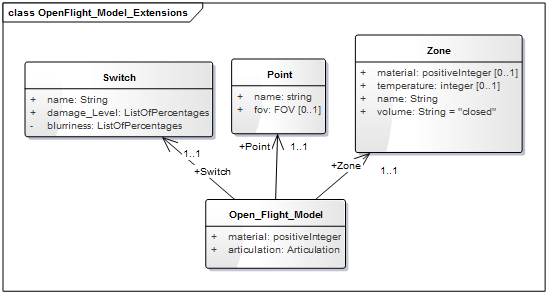

== 3D Model Extensions

All of the statically positioned cultural features and the moving models are represented in the OpenFlight format. As such, OpenFlight plays a significant role, since. To add attributes to OpenFlight models, OpenFlight_Model_Extensions.xsd schema file can be used to verify the changes. The below diagram is generated from this schema file which is located in the CDB schema folder (/CDB/Metadata/Schema/).

[#img_UMLdiagramofOpenFlightmodelextensions,reftext='{figure-caption} {counter:figure-num}']
.UML diagram of OpenFlight model extensions

