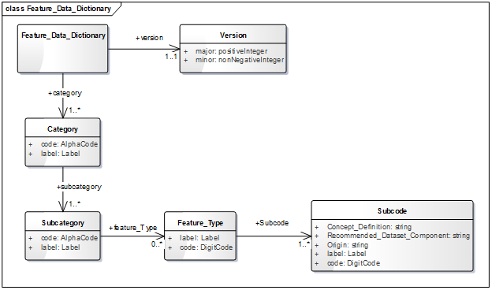

== Feature Data Dictionary

The CDB Feature Data Dictionary (FDD) is provided with the CDB standard in the form of an XML file including the complete list of the supported feature codes. The following UML diagram is generated using the XML stylesheet which is provided to format and display the dictionary inside a standard Web browser. Furthermore, the schema can also be found in the schema subdirectory of the CDB Schema Distribution Package.

[#img_UMLdiagramoffeaturedatadictionary,reftext='{figure-caption} {counter:figure-num}']
.UML diagram of feature data dictionary

The main properties of the feature data dictionary UML diagram are documented below.

[cols=",,,",]
|============================================================================================================================================================================
|*Name* |*Definition* |*Data type & Value* |*Multiplicity*
|AlphaCode |The code of the category or subcategory. |string |One (mandatory)
|Feature_Data_Dictionary |This element represents the CDB Feature Data Dictionary root element. It has a version number and the list of all categories. |XML |One (mandatory)
|Feature_Type |This element has a code attribute, a label and a list of subcodes. |Feature_Type |Zero or more (optional)
|Label |A meaningful name to the code attribute. |string |One (mandatory)
|Subcategory |Has a code attribute, a label and a list of feature types. |Feature_Type |One or more (mandatory)
|Subcode |Has a code attribute, a label, a concept definition, a recommended dataset component and an origin. |Subcode |Zero or more (optional)
|Version |This attribute represents the version number of FDD. |Array of strings |One (mandatory)
|============================================================================================================================================================================
